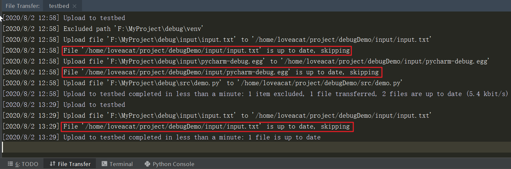

# 远程部署
文件传输的方式：

- FTP / HTTP
- SFTP
- SCP
- rz/sz 命令
- Intellij 的 deploy 功能

## 1. FTP / HTTP
FTP（File Transfer Protocol，文件传输协议）和 HTTP（HyperText Transfer Protocol，超文本传输协议）都是可以用来传输二进制文件的，在日常的使用中我们可以利用 Python 来快速地启动一个 FTP / HTTP 服务器。

### 1.1 FTP
需要先安装一个 FTP 的模块：
```shell
pip install pyftpdlib
```
可以使用如下命令快速启动一个 FTP 服务器：
```shell
python -m pyftpdlib -w -p 2121 -d path/to/root/folder
```
上述命令的第一个参数 `-m` 是 Python 解释器的参数，意思是将 `pyftpdlib` 这个模块作为脚本来运行，因为运行 Python 脚本时我们需要提供脚本的路径，但我们现在并不知道 `pyftpdlib` 模块的具体安装路径，因此加入 `-m` 参数让解释器帮我们找到这个模块，并将其作为脚本运行。
`pyftpdlib` 后面的参数是这个模块作为脚本运行时所需的参数，`-w` 代表为匿名登录的用户开启**写权限**，`-p 2121` 则是 FTP 服务的控制端口，`-d path/to/root/folder` 指定的是 FTP 服务的根目录。

### 1.2 HTTP
Python 中内置了一个简单的 HTTP server，在 Python 2 中可以使用如下命令在 `8080` 端口开启一个 HTTP 服务：
```shell
python -m SimpleHTTPServer 8080
```
在 Python 3 中的命令则是：
```shell
python -m http.server 8080
```
服务开启之后就可进行访问了，这样开启的 HTTP 服务会将当前目录作为根目录，并且仅支持 `GET` 请求，不支持 `POST` 请求，也就是说仅能下载文件，无法上传文件。

## 2. SFTP
SFTP （SSH File Transfer Protocol，也称Secret File Transfer Protocol），它是经过 SSH 协议封装的 FTP 协议，相比于 FTP 协议更加安全，FTP 协议与 HTTP 协议都是明文协议。SFTP 可以像 FTP 协议那样操纵和管理文件，功能比较全面，比较重量级。  
仅需要在远程主机上安装 SSH 服务端即可提供 SFTP 服务，我们可以通过本地的 SSH 客户端与远程主机建立连接，传输文件。连接的配置与 SSH 相同，端口都是 `22`，用户名和密码即是 SSH 的用户名和密码。  

在 Windows 上可以作为客户端传输文件的主要有下面几个：  

- WinSCP：它是一个 Windows 平台下的图形化 SFTP 客户端，支持 SFTP 和 SCP 协议，这个比较好用，但可惜的是 Xshell 与 Xftp 绑定了，用 Xftp 已经够了。
- Xftp：它是 Windows 平台下支持 FTP 和 SFTP 协议的客户端，点击 Xshell 的 *文件传输按钮* 默认调用的就是这个软件。
- Xshell：它本质是一个 Windows 平台下的 SSH 客户端，但它同时也支持 SFTP 协议，没有安装 Xftp 的情况下也是能够传输文件的。


## 3. SCP
SCP 是 Secure Copy 的缩写，用于两台主机之间的数据传输，其数据传输使用的是 SSH 协议，利用了 SSH 协议的加密和认证方式。它有对应的非加密版本：RCP，不推荐使用。  

scp命令的语法如下：  
```shell
scp [可选参数] file_source file_target 
```

平时主要使用的参数如下：

| 参数 | 说明                                               |
| :--- | :------------------------------------------------- |
| -4   | 强制仅使用 IPv4 地址                                |
| -6   | 强制仅使用 IPv6 地址                                |
| -p   | 保留原文件的**修改时间**，**访问时间**和**访问权限** |
| -r   | 递归传输整个目录                                    |
| -P   | （大写），指定远程端口号                             |

示例：将文件从本地拷贝到远程主机  
```shell
scp /path/to/local/file user@remote-address:/path/to/remote/file
```
远程主机的参数以 *用户名* 头，以 *@* 作为分隔符，后面是 *远程主机的地址* ，然后以 *:* 作为分隔符，最后是远程文件的路径。远程文件的路径如果是**相对路径**，则是根据前面的用户家目录计算的，如果是空则代表目的路径就是用户的家目录，如：  
```shell
scp /path/to/local/file user@remote-address:
```
如果是将远程的目录拷贝到本地，仅需要将上面两个参数的位置调换即可，并且需要加上 `-r` 参数。   
```shell
scp -r user@remote-address:/path/to/remote/dir /path/to/local/dir
```

## 4. rz/sz 命令（lrzsz）
前面说的方法都比较重量级，lrzsz 使用起来比较方便，需要打的命令也比较短，**缺点是它不能传输文件夹，并且不推荐用它传输大文件**。  

lrzsz 是一个 Unix 下支持 XMODEM、YMODEM 和 ZMODEM 文件传输协议的工具，是免费且开源的。为了能够在 Windows 平台使用，我们需要安装支持上述三种协议之一的 SSH 客户端，如 Xshell。MobaXterm 应该是不支持的。  

默认 Linux 中是没有这个工具的，我们需要手动安装，命令如下：    
```shell
yum install lrzsz
```

示例：将文件上传到远程主机  
```shell
rz [可选参数]
```
运行这个命令后会弹出一个选择界面，在里面选择想要传输的文件后点击确定即可。平时直接使用无参数的就足够了，当然它也有很多参数，下面是一些可能会用到的：  

| 参数 | 说明                                           |
| :-- | :--------------------------------------------- |
| -+   | 在已有的文件后面追加                             |
| -E   | 如果已经有同名文件了则自动重命名，这个是默认开启的 |
| -y   | 直接覆盖同名文件                                |
| -r   | 尝试恢复之前被打断的传输（仅支持ZMODEM）          |
| -a   | 将 ASCII的 CR/LF 替换为 LF                      |

这里值得注意的是 `-a` 参数，它会将 Windows 平台下的换行符替换为 Unix 平台下的，在传输 shell 脚本之类的文件时很有用。  

示例：从远程主机下载文件
```shell
sz [可选参数] path/to/file ...
```
这个命令运行后同样会弹出一个选择界面，在里面选择文件的保存路径，常用的参数与 `rz` 基本类似。  


## 5. Intellij 的 deploy 功能
Intellij 全家桶的商业版本都自带一个 deploy 功能，使用这个功能可以很方便地将我们在项目中的修改同步到远程主机上。该功能使用的是 SFTP 来传输文件，可以实现项目文件的**全量**/**增量**同步，并且可以在同步后修改远程文件的访问权限，也可以单独为某个文件或目录单独指定映射规则。  

deploy 功能在 `Tools > Deployment` 菜单下，可以通过 `Configuration` 和 `Options` 两个界面对其进行配置。  


### 5.1 deploy 功能的配置
#### 5.1.1 添加远程主机
首先点击 `Configuration` 添加远程主机，整个界面分为三个选项卡：Connection、Mappings 和 Excluded Paths。Connection 中是文件传输的相关配置，如传输协议（有 SFTP、FTP、FTPS、Local or mounted folder 和 inplace 五种）；Mappings 中是本地工程目录和远程工程目录之间的路径映射，也可以为单独某个文件指定专门的映射；Excluded Paths 中是传输时需要忽略的目录和文件，例如 `.idea`、`venv`等 IDE 相关或者远程主机用不上的文件或目录。**如果一个文件夹已经被标记为 *Excluded*，在传输时是默认忽略的，不需要再配置了**。  


#### 5.1.2 配置传输选项
`Options` 中主要配置的是整个文件同步的选项，是适用于上面配置的所有远程主机的。  


1. 根据文件名忽略文件，支持通配符
2. 覆盖最新的文件，取消勾选可以实现增量更新
3. 传输的时候保留文件的时间戳
4. 删除远程主机上在本地没有的文件
5. 创建空的文件夹
6. 自动传输修改过的文件，有三种触发类型：Ctrl+S、Always 和 Never
7. 忽略外部的改动，比如我们使用 sublime 修改了项目中的文件，这时候不会触发自动传输
8. 这个是修改传输后文件和目录的访问权限，修改的粒度较大，是全部都这样修改。

### 5.2 deploy功能的使用
deploy 功能的使用比较简单，我们在左侧的项目视图中选中我们想要同步的文件或者目录，右键：  
  
点击 Upload to xxx，就可以开始传输文件了。当然也可以点击 Download from xxx 将我们在远程主机上所做的改动拉下来。点击后在下方会弹出提示，可以看到红框中的文件因为时间戳是最新的就跳过了。  
  
